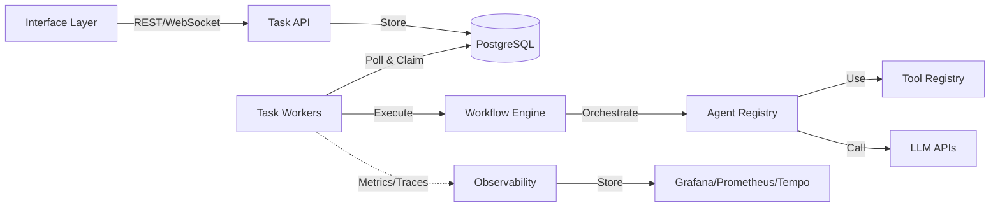

# Multi-Agent Task Orchestration Platform

An experimental platform for building and orchestrating AI agent workflows, developed as a learning project to understand agentic AI systems from first principles.

## Project Goals

This is a **learning and experimentation project** with three primary objectives:

### 1. 🧪 Understanding Agentic AI
Deliberately **eschews modern AI frameworks** (LangChain, CrewAI, etc.) to deeply understand the mechanics of multi-agent systems. By building from scratch with FastAPI, PostgreSQL, and OpenTelemetry, the project explores:
- Agent coordination patterns
- State machine architectures
- Workflow orchestration
- Tool integration
- Observability in AI systems

*Feel the pain, learn the patterns, then appreciate the abstractions.*

### 2. 🤖 AI-Assisted Development
An ongoing experiment in **using AI effectively for software development**. The codebase itself serves as a testbed for:
- AI-driven refactoring and code review
- Test generation and quality improvements
- Architecture design with AI assistance
- Documentation creation

*How can AI tools accelerate development without sacrificing code quality?*

### 3. 🏗️ Sovereign AI Platform
Building toward a **personal AI platform** with full control and privacy. Currently uses OpenRouter for LLM access, but designed to:
- Run locally with self-hosted models
- Maintain user privacy (email hashing, local data)
- Support custom agents and workflows
- Enable multi-tenancy for different use cases

*Your data, your models, your infrastructure.*

## What This Platform Can Do

### Core Capabilities

**Declarative Workflow Engine**
- Define multi-step agent workflows in YAML without writing code
- Sequential and iterative coordination strategies
- Automatic workflow discovery and registration

**Agent & Tool System**
- Pluggable agent architecture with base classes
- Registry-based agent management (YAML, auto-discovery, programmatic)
- Reusable tool system for shared capabilities
- Singleton caching for performance

**Distributed Task Processing**
- Worker-based task execution with horizontal scaling
- Lease-based concurrency (database-backed task claiming)
- Fault tolerance with automatic lease recovery
- State machine-driven execution (explicit state transitions)

**Full Observability**
- Distributed tracing with OpenTelemetry and Grafana Tempo
- Prometheus metrics for queue depth, throughput, costs
- Management UI for task search, user analytics, cost tracking
- Immutable audit logs for compliance

**Privacy & Multi-Tenancy**
- SHA-256 hashed user emails (privacy-preserving tracking)
- Tenant isolation for multi-environment deployments
- mTLS authentication for secure API access
- Cost tracking per user and per tenant

## Architecture Overview



### Key Components

| Component | Purpose |
|-----------|---------|
| **Task API** | FastAPI-based REST API for task submission and status queries |
| **Workers** | Background processors that claim and execute tasks |
| **PostgreSQL** | Task storage, workflow state, audit logs |
| **Workflow Engine** | Declarative orchestrator for multi-agent coordination |
| **Agent Registry** | Centralized catalog of available agents |
| **Tool Registry** | Reusable capabilities agents can invoke |
| **Observability Stack** | OpenTelemetry, Grafana Tempo, Prometheus |

### Execution Model

Tasks follow a strict state machine:

```
PENDING → (worker claims) → RUNNING → (execution) → DONE
                                    ↓
                                  ERROR
```

**Concurrency:** Lease-based task claiming with `FOR UPDATE SKIP LOCKED` ensures exactly-once processing across multiple workers.

See [Architecture Guide](docs/ARCHITECTURE.md) for technical details.

## Quick Start

```bash
# 1. Clone and configure
git clone <repository>
cd agents_playground
cp .env.example .env
# Edit .env and add your OPENROUTER_API_KEY

# 2. Generate SSL certificates
./utils/generate_certs.sh

# 3. Start the stack
docker-compose up -d

# 4. Verify services
curl http://localhost:8000/health

# 5. Submit a task
curl -X POST http://localhost:8000/tasks \
  -H "Content-Type: application/json" \
  -d '{"type": "workflow:research_assessment", "input": {"topic": "renewable energy"}}'
```

See [Quick Start Guide](docs/QUICKSTART.md) for detailed setup.

## Usage Examples

### Example Interface: Open WebUI Integration

One way to interact with the platform is through Open WebUI:

```
@flow research_assessment analyze quantum computing
@agent research gather solar panel information
@tool web_search find API design best practices
```

See [Open WebUI Integration](docs/OPENWEBUI.md) for setup.

**Other interfaces can be easily added:**
- CLI tools
- Slack/Discord bots
- Web dashboards
- VS Code extensions
- Jupyter notebooks

### Create a Custom Workflow

```yaml
# app/workflows/content_review.yaml
name: content_review
description: Generate and review content
coordination_type: iterative_refinement
max_iterations: 3

steps:
  - agent_type: research
    name: create_draft
  - agent_type: assessment
    name: review_quality
```

### Build a Custom Agent

```python
# app/agents/summarizer_agent.py
from app.agents.base import Agent

class SummarizerAgent(Agent):
    def __init__(self):
        super().__init__(
            agent_type="summarizer",
            tools=[]
        )

    def execute(self, input_data, user_id_hash=None):
        text = input_data.get("text")
        summary = self._call_llm(f"Summarize: {text}")

        return {
            "summary": summary,
            "usage": {"input_tokens": 100, "output_tokens": 50}
        }
```

Agents are auto-discovered on startup.

## Technology Choices

Built with foundational technologies, avoiding high-level AI frameworks:

| Layer | Technology | Why |
|-------|------------|-----|
| **API** | FastAPI | Async Python, excellent performance |
| **Database** | PostgreSQL 18 | ACID guarantees, complex queries, proven reliability |
| **ORM** | SQLAlchemy 2.0 | Async support, explicit control |
| **Tracing** | OpenTelemetry + Tempo | Industry standard, vendor-neutral |
| **Metrics** | Prometheus | De facto standard for metrics |
| **State Management** | Custom state machines | Explicit, testable, observable |
| **Orchestration** | Custom YAML-based engine | Full visibility into coordination logic |

**No LangChain, No CrewAI, No AutoGen** - Learning by building the primitives.

## Services & Interfaces

| Service | URL | Purpose |
|---------|-----|---------|
| **Task API** | http://localhost:8000 | REST API for task management |
| **Management UI** | http://localhost:8501 | Task monitoring, cost analytics, debugging |
| **Grafana** | http://localhost:3002 | Distributed tracing visualization |
| **Prometheus** | http://localhost:9090 | Metrics and monitoring |
| **Open WebUI** | http://localhost:3000 | Example chat interface |

## Documentation

### Getting Started
- **[Quick Start](docs/QUICKSTART.md)** - Setup and first workflow
- **[Workflows Guide](docs/WORKFLOWS.md)** - Build declarative workflows
- **[API Reference](docs/API_REFERENCE.md)** - REST API documentation

### Technical Deep Dives
- **[System Architecture](docs/ARCHITECTURE.md)** - Design and implementation
- **[Agent Registry](docs/AGENT_REGISTRY.md)** - Agent management system
- **[Tool Registry](docs/TOOL_REGISTRY.md)** - Tool integration
- **[Worker State Machines](docs/statemachines/WORKER_STATEMACHINE.md)** - State diagrams

### Operations
- **[Monitoring](docs/MONITORING.md)** - Observability and debugging
- **[Troubleshooting](docs/TROUBLESHOOTING.md)** - Common issues
- **[Worker Scaling](docs/WORKER_SCALING.md)** - Horizontal scaling

### Development
- **[Development Guide](docs/DEVELOPMENT.md)** - Code quality and workflows
- **[Open WebUI Integration](docs/OPENWEBUI.md)** - Example interface

## Project Structure

```
agents_playground/
├── app/                        # Application code
│   ├── agents/                 # Agent implementations
│   ├── tools/                  # Tool implementations
│   ├── workflows/              # YAML workflow definitions
│   ├── orchestrator/           # Workflow execution engine
│   ├── worker_state.py         # Worker state machine
│   ├── task_state.py           # Task execution state machine
│   └── main.py                 # FastAPI application
├── config/                     # Agent/tool configurations (optional)
├── docs/                       # Documentation
├── integrations/               # Example interfaces (Open WebUI, etc.)
├── monitoring/                 # Observability stack configs
├── tests/                      # Test suite
└── docker-compose.yml          # Service orchestration
```

See [Development Guide](docs/DEVELOPMENT.md#project-structure) for detailed breakdown.

## What You Can Learn Here

### Agentic AI Patterns
- **Multi-agent coordination** (sequential, iterative, convergence checks)
- **State machine architectures** for reliable execution
- **Tool integration** patterns
- **Workflow as code** vs. workflow as configuration

### Distributed Systems
- **Lease-based concurrency** for task claiming
- **Database-backed coordination** without external queues
- **Fault tolerance** through lease recovery
- **Horizontal scalability** with stateless workers

### Observability
- **Distributed tracing** propagation across services
- **Metrics instrumentation** for async systems
- **Cost tracking** for LLM usage
- **Audit logging** for compliance

### Software Engineering
- **State machines** for complex workflows
- **Registry patterns** for plugin architectures
- **Declarative vs. imperative** orchestration
- **Testing strategies** for AI systems

## Current Limitations & Future Work

**Current state:**
- Uses OpenRouter for LLM access (cloud dependency)
- Basic coordination strategies (sequential, iterative)
- Manual workflow deployment (restart required)
- Limited tool ecosystem

**Planned experiments:**
- Local LLM integration (Ollama, vLLM)
- Additional coordination patterns (parallel, DAG-based, reactive)
- Hot-reload for workflows and agents
- RAG integration with Qdrant
- Custom tool marketplace
- Web-based workflow designer

## Development Setup

```bash
# Install dependencies
pip install -r requirements.txt
pip install -r requirements-dev.txt

# Install pre-commit hooks
pre-commit install

# Run quality checks
make validate  # Linting, type checking, tests

# Start database only
docker-compose up -d postgres qdrant

# Run API locally
uvicorn app.main:app --reload

# Run worker locally
python -m app.worker
```

See [Development Guide](docs/DEVELOPMENT.md) for details.

## Requirements

- Docker 20.10+ and Docker Compose 2.0+
- OpenRouter API key (or compatible LLM API endpoint)
- 4GB+ RAM for all services

## Contributing

This is a learning project, but contributions and discussions are welcome! If you're also experimenting with agentic AI or AI-assisted development, feel free to:
- Open issues with questions or ideas
- Submit PRs with improvements
- Share your experiments and findings

Please ensure `make validate` passes (linting, type checks, tests).

## License

This project is provided as-is for educational and experimental purposes.

---

**Interested in the journey?** Check out the commit history to see how AI-assisted development shaped this codebase, or dive into the [Architecture Guide](docs/ARCHITECTURE.md) to understand the design decisions.
