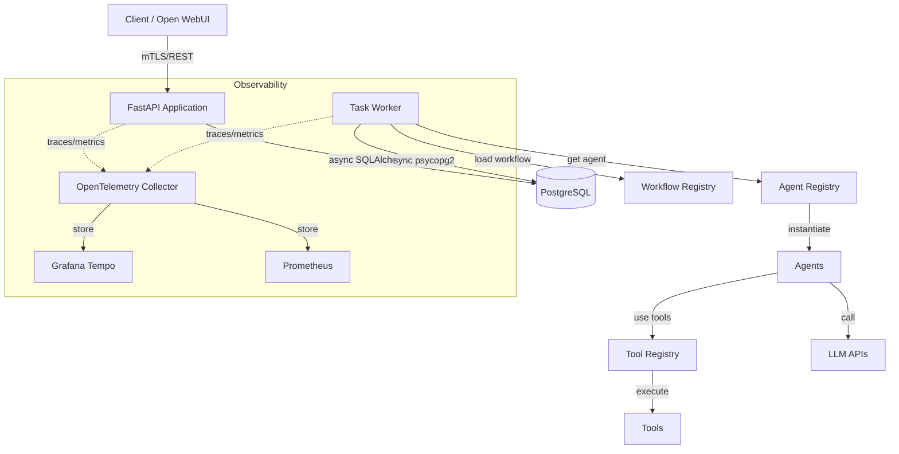
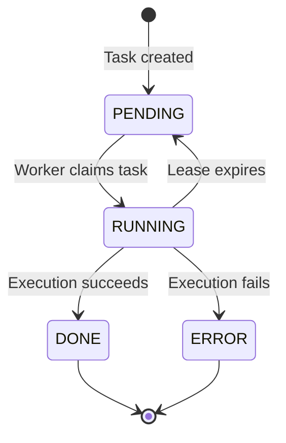

# System Architecture

This document provides a detailed technical overview of the multi-agent task orchestration system architecture.

## Overview

The system is a **distributed, event-driven task processing platform** built around these core principles:

- **Async-first**: Non-blocking I/O throughout the stack
- **State machine driven**: Explicit state transitions for tasks and workers
- **Lease-based concurrency**: Multi-worker safe task claiming
- **Observable**: Distributed tracing and metrics at every layer
- **Declarative**: Workflows defined in YAML without code

## System Components



## Core Services

### 1. Task API (`task-api`)

**Responsibilities:**
- Accept task creation requests via REST API
- Store tasks in PostgreSQL
- Provide task status queries
- Broadcast real-time updates via WebSocket
- Serve registry endpoints (agents, tools, workflows)

**Technology:**
- FastAPI (async web framework)
- SQLAlchemy 2.0 with asyncpg (async ORM)
- Pydantic (request/response validation)
- WebSockets (real-time updates)

**Key files:**
- `app/main.py` - Application entry point
- `app/routers/tasks.py` - Task CRUD endpoints
- `app/database.py` - Async database connection
- `app/websocket.py` - WebSocket manager

### 2. Task Worker (`task-worker`)

**Responsibilities:**
- Poll database for pending tasks
- Claim tasks with time-bound leases
- Execute tasks (agents, workflows, tools)
- Update task status and results
- Recover from failures

**Technology:**
- Synchronous Python (psycopg2 for DB)
- State machine architecture
- OpenTelemetry instrumentation
- Signal-based graceful shutdown

**Key files:**
- `app/worker.py` - Entry point
- `app/worker_state.py` - Worker state machine
- `app/task_state.py` - Task execution state machine
- `app/worker_helpers.py` - Task processing logic
- `app/worker_lease.py` - Lease management

### 3. PostgreSQL Database

**Responsibilities:**
- Persistent storage for tasks, workflows, audit logs
- ACID guarantees for task state transitions
- Indexing for efficient queries
- pgvector extension for embeddings (future use)

**Schema:** See [Database Schema](#database-schema) below

### 4. Qdrant Vector Database

**Responsibilities:**
- Vector similarity search
- Embedding storage
- Semantic search capabilities

**Usage:** Currently optional, integrated for future RAG features

### 5. Open WebUI

**Responsibilities:**
- Chat interface for users
- Tool execution (@flow, @agent, @tool commands)
- Document upload and processing

**Integration:** See [OPENWEBUI.md](OPENWEBUI.md)

## Database Schema

### Core Tables

#### tasks
Primary table for task lifecycle management.

```sql
CREATE TABLE tasks (
    id UUID PRIMARY KEY DEFAULT gen_random_uuid(),
    type TEXT NOT NULL,                  -- 'workflow:name', 'agent:type', 'tool:name'
    status TEXT NOT NULL DEFAULT 'pending',  -- State: pending|running|done|error
    input JSONB NOT NULL,
    output JSONB,
    error TEXT,

    -- User tracking (privacy-preserving)
    user_id_hash VARCHAR(64),            -- SHA-256 hashed email
    tenant_id VARCHAR(100),              -- Environment identifier

    -- Cost tracking
    model_used VARCHAR(100),
    input_tokens INTEGER,
    output_tokens INTEGER,
    total_cost DECIMAL(10, 6),

    -- Tracing
    generation_id TEXT,                  -- Trace ID for distributed tracing

    -- Timestamps
    created_at TIMESTAMP WITH TIME ZONE DEFAULT now(),
    updated_at TIMESTAMP WITH TIME ZONE DEFAULT now(),

    -- Worker lease
    lease_expires_at TIMESTAMP WITH TIME ZONE,
    worker_id TEXT
);

CREATE INDEX idx_tasks_status ON tasks(status);
CREATE INDEX idx_tasks_lease ON tasks(lease_expires_at) WHERE status = 'running';
CREATE INDEX idx_tasks_user_hash ON tasks(user_id_hash);
CREATE INDEX idx_tasks_tenant ON tasks(tenant_id);
CREATE INDEX idx_tasks_user_tenant ON tasks(user_id_hash, tenant_id);
```

#### subtasks
Child tasks for multi-step workflows.

```sql
CREATE TABLE subtasks (
    id UUID PRIMARY KEY DEFAULT gen_random_uuid(),
    parent_task_id UUID NOT NULL REFERENCES tasks(id) ON DELETE CASCADE,
    agent_type TEXT NOT NULL,
    step_name TEXT,
    iteration INTEGER DEFAULT 1,
    status TEXT NOT NULL DEFAULT 'pending',
    input JSONB NOT NULL,
    output JSONB,
    error TEXT,

    -- Same tracking fields as tasks
    user_id_hash VARCHAR(64),
    tenant_id VARCHAR(100),
    model_used VARCHAR(100),
    input_tokens INTEGER,
    output_tokens INTEGER,
    total_cost DECIMAL(10, 6),

    created_at TIMESTAMP WITH TIME ZONE DEFAULT now(),
    completed_at TIMESTAMP WITH TIME ZONE
);

CREATE INDEX idx_subtasks_parent ON subtasks(parent_task_id);
CREATE INDEX idx_subtasks_status ON subtasks(status);
```

#### workflow_state
Tracks multi-step workflow execution state.

```sql
CREATE TABLE workflow_state (
    id UUID PRIMARY KEY DEFAULT gen_random_uuid(),
    parent_task_id UUID NOT NULL REFERENCES tasks(id) ON DELETE CASCADE,
    workflow_name TEXT NOT NULL,
    current_step INTEGER DEFAULT 0,
    current_iteration INTEGER DEFAULT 1,
    max_iterations INTEGER DEFAULT 3,
    converged BOOLEAN DEFAULT FALSE,
    accumulated_output JSONB,

    user_id_hash VARCHAR(64),
    tenant_id VARCHAR(100),

    created_at TIMESTAMP WITH TIME ZONE DEFAULT now(),
    updated_at TIMESTAMP WITH TIME ZONE DEFAULT now()
);

CREATE INDEX idx_workflow_parent ON workflow_state(parent_task_id);
```

#### audit_logs
Immutable audit trail for compliance and debugging.

```sql
CREATE TABLE audit_logs (
    id UUID PRIMARY KEY DEFAULT gen_random_uuid(),
    event_type VARCHAR(50) NOT NULL,     -- task_created, task_updated, etc.
    resource_id UUID NOT NULL,           -- Task or subtask ID
    user_id_hash VARCHAR(64),
    tenant_id VARCHAR(100),
    timestamp TIMESTAMP WITH TIME ZONE DEFAULT now(),
    metadata JSONB                       -- Event-specific details
);

CREATE INDEX idx_audit_user ON audit_logs(user_id_hash);
CREATE INDEX idx_audit_tenant ON audit_logs(tenant_id);
CREATE INDEX idx_audit_resource ON audit_logs(resource_id);
CREATE INDEX idx_audit_timestamp ON audit_logs(timestamp);
```

## Execution Model

### Task Lifecycle (State Machine)

Tasks follow a strict state machine with these states:



**States:**
- `PENDING` - Waiting for worker to claim
- `RUNNING` - Being processed by worker (has active lease)
- `DONE` - Successfully completed
- `ERROR` - Failed with error message

**Lease mechanism:** When a worker claims a task, it sets `lease_expires_at` to `now() + 5 minutes`. If the worker crashes, another worker can reclaim the task after lease expiry.

See [Worker State Machine](statemachines/WORKER_STATEMACHINE.md) for detailed state diagrams.

### Worker Execution Loop

```
1. IDLE → Connect to database
2. CONNECTED → Recover expired leases
3. CONNECTED → Claim next pending task
4. PROCESSING → Execute task (agent/workflow/tool)
5. PROCESSING → Update task status (done/error)
6. PROCESSING → Release lease
7. CONNECTED → (repeat from step 3)
```

**Graceful shutdown:** Workers listen for SIGTERM/SIGINT and complete current task before exiting.

### Workflow Execution

For `workflow:*` task types, the worker delegates to the orchestrator:

```
1. Worker claims workflow task
2. Initialize workflow state in database
3. For each step in workflow definition:
   a. Create subtask for agent
   b. Execute subtask
   c. Update workflow state
   d. Check convergence (for iterative workflows)
4. Aggregate results
5. Mark parent task as done
```

**Iterative workflows:** Loop through steps multiple times until convergence check passes or max iterations reached.

## Data Flow

### Task Submission Flow

```
Client
  ↓ POST /tasks {"type": "workflow:research_assessment", "input": {...}}
API
  ↓ INSERT INTO tasks (type, status='pending', input)
Database
  ↓ Task ID returned
API
  ↓ WebSocket broadcast: task_created
Client
  ↓ Receives task ID, polls for status
```

### Task Execution Flow

```
Worker
  ↓ SELECT next pending task FOR UPDATE SKIP LOCKED
Database
  ↓ Task locked and returned
Worker
  ↓ UPDATE tasks SET status='running', lease_expires_at=now()+5min
  ↓ Execute agent/workflow/tool
  ↓ UPDATE tasks SET status='done', output=result
Database
  ↓ Task completed
API (via polling)
  ↓ WebSocket broadcast: task_updated
Client
  ↓ Receives result
```

### Distributed Tracing Flow

```
Open WebUI Tool
  ↓ Generates trace_id, injects into task.input._trace_context
API
  ↓ Stores task with trace context
Worker
  ↓ Extracts trace_id from task.input._trace_context
  ↓ Creates root span with trace_id
Orchestrator
  ↓ Creates child spans (one per subtask)
Agent
  ↓ Creates nested span for LLM call
  ↓ Exports to OpenTelemetry Collector
OTel Collector
  ↓ Forwards to Grafana Tempo
Grafana
  ↓ User views unified trace
```

## Concurrency & Scaling

### Multi-Worker Concurrency

**Lease-based task claiming** ensures tasks are processed exactly once:

```sql
-- Worker 1 and Worker 2 both try to claim
UPDATE tasks
SET status = 'running',
    lease_expires_at = now() + interval '5 minutes',
    worker_id = 'worker-1'
WHERE id = (
    SELECT id FROM tasks
    WHERE status = 'pending'
    ORDER BY created_at
    LIMIT 1
    FOR UPDATE SKIP LOCKED  -- Critical: Skip locked rows
)
RETURNING *;
```

**`FOR UPDATE SKIP LOCKED`** ensures that only one worker succeeds in claiming the task.

### Lease Recovery

If a worker crashes mid-task, the lease expires and the task becomes reclaimable:

```sql
-- Recover tasks with expired leases
UPDATE tasks
SET status = 'pending',
    lease_expires_at = NULL,
    worker_id = NULL
WHERE status = 'running'
  AND lease_expires_at < now();
```

### Horizontal Scaling

Workers are **stateless** and scale horizontally:

```bash
docker-compose up -d --scale task-worker=5
```

**Characteristics:**
- ✅ Each worker has independent in-memory registries (agents, tools, workflows)
- ✅ Database acts as coordination point
- ✅ No inter-worker communication needed
- ⚠️ Brief version skew during rolling deploys (~30-60s)

See [WORKER_SCALING.md](WORKER_SCALING.md) for details.

## User Tracking & Multi-Tenancy

### Privacy-Preserving User Tracking

User emails are **SHA-256 hashed** before storage:

```python
import hashlib

def hash_email(email: str) -> str:
    return hashlib.sha256(email.encode()).hexdigest()
```

**Flow:**
1. Client sends plain email in request body
2. API hashes immediately: `user_id_hash = hash_email(email)`
3. Only hash stored in database
4. Management UI allows lookup by email (hashes on search)

### Multi-Tenancy

The `tenant_id` field enables environment-based isolation:

- **Usage:** Set in Open WebUI tool configuration
- **Purpose:** Separate production/staging data, or multi-customer deployments
- **Queries:** All queries include `WHERE tenant_id = ?` filter

```sql
-- Get tasks for specific tenant
SELECT * FROM tasks
WHERE tenant_id = 'production'
  AND user_id_hash = '...';
```

## Registry Architecture

### Agent Registry

Agents are registered using one of three methods:

1. **YAML**: `config/agents.yaml` loaded at startup
2. **Auto-discovery**: Files in `app/agents/` automatically detected
3. **Programmatic**: `registry.register(name, class, config)`

**Singleton pattern:** Agents cached in memory for performance.

See [AGENT_REGISTRY.md](AGENT_REGISTRY.md) for details.

### Tool Registry

Tools registered similarly to agents:

```python
from app.tools.registry_init import tool_registry

tool = tool_registry.get("web_search")
result = tool.execute(query="...")
```

See [TOOL_REGISTRY.md](TOOL_REGISTRY.md) for details.

### Workflow Registry

Workflows auto-loaded from `app/workflows/*.yaml` at startup:

```python
from app.workflow_init import workflow_registry

definition = workflow_registry.get("research_assessment")
```

See [WORKFLOWS.md](WORKFLOWS.md) for details.

## Security

### mTLS Authentication

API requires client certificates for authentication:

```yaml
# docker-compose.yml
environment:
  - SSL_CA_CERT=/app/certs/ca-cert.pem
  - SSL_SERVER_CERT=/app/certs/server-cert.pem
  - SSL_SERVER_KEY=/app/certs/server-key.pem
```

**Certificate chain:**
1. CA certificate (self-signed for testing)
2. Server certificate (signed by CA)
3. Client certificate (signed by CA)

**⚠️ Production:** Use certificates from a trusted CA, not self-signed.

### Database Security

- **Network isolation:** PostgreSQL only accessible within Docker network
- **Strong passwords:** Configured in `.env`
- **Connection pooling:** Limits concurrent connections

### Secret Management

All secrets in `.env` file:
- Never committed to Git (`.gitignore` rule)
- Inject via Docker environment variables
- Rotate regularly in production

## Technology Stack

| Layer | Technology | Purpose |
|-------|------------|---------|
| **API** | FastAPI | Async web framework |
| **ORM** | SQLAlchemy 2.0 + asyncpg | Async database access |
| **Database** | PostgreSQL 18 | ACID-compliant storage |
| **Vector DB** | Qdrant | Embeddings and similarity search |
| **Tracing** | OpenTelemetry + Tempo | Distributed tracing |
| **Metrics** | Prometheus | Time-series metrics |
| **UI** | Streamlit | Management dashboard |
| **Chat UI** | Open WebUI | User interaction |
| **Config** | Pydantic Settings | Environment-based config |
| **Validation** | Pydantic | Request/response schemas |

## Performance Characteristics

| Operation | Latency | Notes |
|-----------|---------|-------|
| Task creation | < 10ms | INSERT + WebSocket broadcast |
| Task claim | < 20ms | SELECT FOR UPDATE SKIP LOCKED |
| Registry lookup | < 0.1ms | In-memory singleton cache |
| Agent execution | 1-30s | Depends on LLM API latency |
| Workflow (3 iterations) | 10-90s | Multiple agent calls |

## See Also

- [Worker State Machine](statemachines/WORKER_STATEMACHINE.md) - Detailed state diagrams
- [Worker Scaling](WORKER_SCALING.md) - Horizontal scaling guide
- [Development Guide](DEVELOPMENT.md) - Code quality and practices
- [API Reference](API_REFERENCE.md) - Complete API documentation
