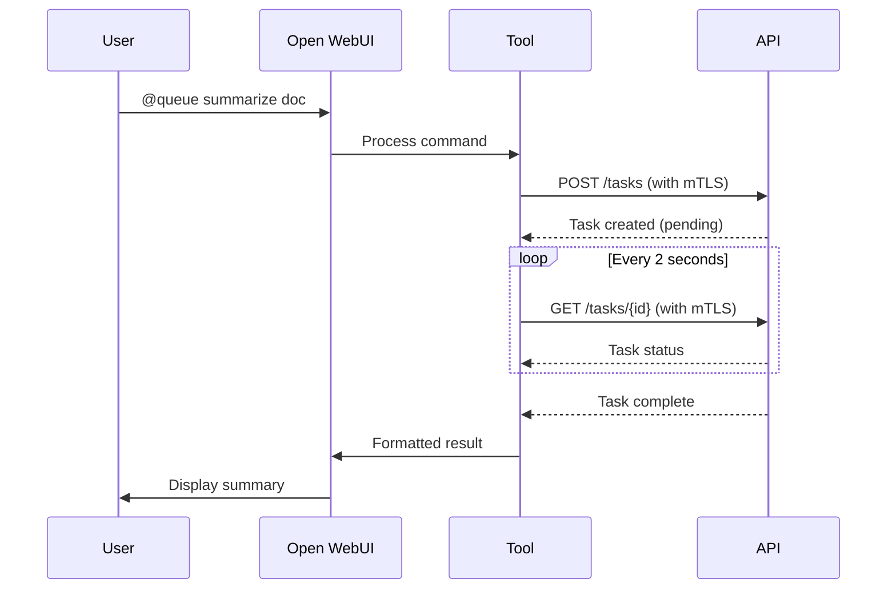

# Open WebUI Integration Guide

Complete guide for integrating the Task Management API with Open WebUI using mTLS authentication.

## Prerequisites

- Open WebUI instance running (via docker-compose)
- Task API service running with mTLS
- SSL certificates generated (CA, client cert, client key)

## Quick Setup

### 1. Environment Variables

The docker-compose configuration already includes the necessary environment variables for Open WebUI:

```yaml
services:
  open-webui:
    environment:
      - TASK_API_URL=https://host.docker.internal:8443
      - CA_CERT_PATH=/app/backend/data/certs/ca-cert.pem
      - CLIENT_CERT_PATH=/app/backend/data/certs/client-cert.pem
      - CLIENT_KEY_PATH=/app/backend/data/certs/client-key.pem
    volumes:
      - ./certs:/app/backend/data/certs:ro
```

**Environment Variables Explained:**
- `TASK_API_URL`: API endpoint (`host.docker.internal:8443` for services on host)
- `CA_CERT_PATH`: Path to CA certificate (inside container)
- `CLIENT_CERT_PATH`: Path to client certificate (inside container)
- `CLIENT_KEY_PATH`: Path to client private key (inside container)

### 2. Certificate Setup

Certificates are automatically mounted from the host `certs/` directory:
```bash
./utils/generate_certs.sh  # Generate if not already done
docker-compose up -d        # Mounts ./certs to container
```

### 3. Install the Task Queue Tool

1. Access Open WebUI at `http://localhost:3000`
2. Go to **Settings** → **Tools**
3. Click **"+ Add Tool"**
4. Copy contents of `openwebui_task_tool.py`
5. Paste into tool editor
6. Click **Save**

### 4. Configure Tool Valves (Optional)

Override environment variables via the tool's UI:

- **task_api_url**: API endpoint (default: from env var)
- **ca_cert_path**: CA certificate path
- **client_cert_path**: Client certificate path
- **client_key_path**: Client key path
- **auto_wait_for_completion**: Auto-wait for tasks (default: `true`)
- **poll_interval_seconds**: Polling frequency (default: `2`)
- **max_wait_seconds**: Max wait time (default: `300`)

## Usage

### Create and Auto-Wait for Task

Upload a file and use:
```
@queue summarize this document
```

The tool will:
1. ✅ Create the task
2. ⏳ Poll every 2 seconds
3. 📝 Return results when complete

### Check Task Status

```
@queue status 094a2531-2349-41f8-9b69-ec53c71d69fc
```

Returns current status immediately.

### Wait for Completion

```
@queue wait 094a2531-2349-41f8-9b69-ec53c71d69fc
```

Polls until task is complete (up to 5 minutes by default).

## Configuration Options

### Disable Auto-Wait

If you prefer manual status checking:
1. Set `auto_wait_for_completion` to `false` in Valves
2. Tasks will queue but not auto-wait
3. Use `@queue wait <id>` when ready

### Adjust Polling

- **Fast polling** (more responsive, more load): `poll_interval_seconds: 1`
- **Slow polling** (less load, slower): `poll_interval_seconds: 5`

### Increase Timeout

For long-running tasks:
```
max_wait_seconds: 600  # 10 minutes
```

## Network Configuration

### Using docker-compose (Recommended)

Services in the same docker-compose stack:
```yaml
TASK_API_URL=http://task-api:8000  # Internal network, no mTLS needed
```

### Open WebUI on host, Task API in container

```yaml
TASK_API_URL=https://host.docker.internal:8443  # Requires mTLS
```

### Different machines

```yaml
TASK_API_URL=https://your-server-ip:8443  # Requires mTLS
```

## Testing

### Test Connection

```
@queue status test-connection
```

**Expected response** (good - means mTLS works):
```
Task test-connection not found
```

**Connection error** (check certificates):
```
ERROR creating task: SSL certificate verify failed
```

### Test Task Creation

Upload a simple text file and run:
```
@queue summarize this file
```

Should create task and wait for completion.

## Troubleshooting

### SSL Certificate Errors

**Error**: `SSL: CERTIFICATE_VERIFY_FAILED`

**Solutions**:
- Verify CA cert path is correct
- Ensure CA cert matches server certificate
- Check certificates are readable by container
- Regenerate certificates if needed: `./utils/generate_certs.sh`

### Connection Refused

**Error**: `Connection refused`

**Solutions**:
- Verify API URL is correct
- Check task-api service is running: `docker-compose ps`
- Verify network connectivity
- For host.docker.internal, ensure Docker Desktop networking works

### Client Certificate Error

**Error**: `SSL handshake failed`

**Solutions**:
- Verify client cert and key paths
- Check certificates match CA
- Ensure client cert is signed by same CA as server
- Check file permissions in container

### Tool Not Working

**Error**: Tool doesn't respond or errors

**Solutions**:
- Check container logs: `docker-compose logs open-webui`
- Verify environment variables: `docker-compose exec open-webui env | grep TASK_API`
- Restart Open WebUI: `docker-compose restart open-webui`
- Check certificates exist in container: `docker-compose exec open-webui ls -la /app/backend/data/certs/`

## How It Works



## Key Features

✅ **mTLS Authentication**: Secure client certificate authentication  
✅ **Auto-Wait**: Automatically polls for completion  
✅ **Smart Polling**: Configurable interval and timeout  
✅ **Formatted Output**: Pretty formatting for summaries  
✅ **Error Handling**: Clear error messages  
✅ **Backward Compatible**: Works with existing @queue commands  

## Security Notes

- Certificates must be readable by Open WebUI process
- Use file permissions to protect private keys: `chmod 600 certs/*.pem`
- Store certificates in secure, mounted volume
- Never commit certificates to version control (.gitignore handles this)
- Certificates are mounted read-only (`:ro`) for security

## Advanced: Manual Certificate Installation

If not using docker-compose volume mounts:

```bash
# Copy certificates to running container
docker cp certs/ca-cert.pem openwebui:/app/backend/data/certs/
docker cp certs/client-cert.pem openwebui:/app/backend/data/certs/
docker cp certs/client-key.pem openwebui:/app/backend/data/certs/

# Set proper permissions
docker exec openwebui chmod 644 /app/backend/data/certs/ca-cert.pem
docker exec openwebui chmod 644 /app/backend/data/certs/client-cert.pem
docker exec openwebui chmod 600 /app/backend/data/certs/client-key.pem
```
