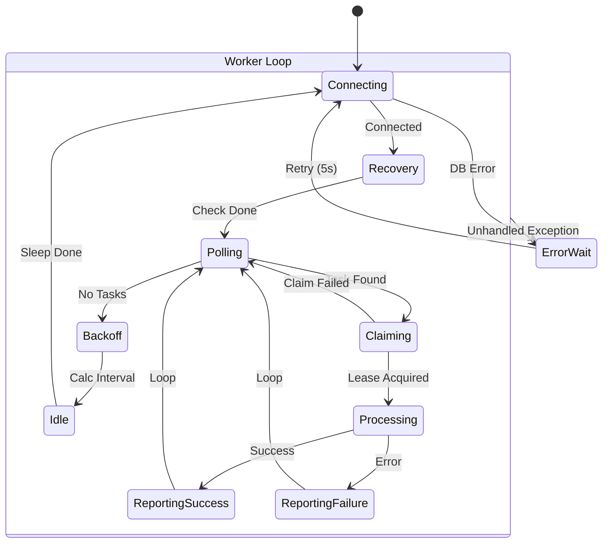

# State Machine Documentation: `app/worker.py`

This document captures the stateful behavior of the worker module (`app/worker.py`), which implements a long-running loop responsible for polling, claiming, and executing tasks from the database. Documenting this state machine is essential for understanding the worker's resilience, lease management, and error handling strategies.

## 1. States

The system transitions through the following logical states at runtime:

*   **Startup** (Worker-level)
    *   The initial state where the worker initializes logging, metrics, and tracing before entering the main loop.
*   **Connecting** (Worker-level)
    *   The worker attempts to establish or re-establish a connection to the PostgreSQL database.
*   **Recovery** (Worker-level)
    *   A periodic state where the worker checks for and resets tasks held by other workers whose leases have expired.
*   **Polling** (Worker-level)
    *   The worker queries the database for the next available pending task that matches its criteria.
*   **Backoff** (Worker-level)
    *   The state entered when no tasks are found, where the worker calculates an increased sleep interval to reduce database load.
*   **Idle** (Worker-level)
    *   The worker sleeps for the calculated duration before restarting the loop.
*   **Claiming** (Task-level context)
    *   The worker attempts to atomically lock a found task by setting its status to `running` and assigning a lease.
*   **Processing** (Task-level context)
    *   The worker executes the business logic for the claimed task, delegating to `execute_task` or specific handlers.
*   **ReportingSuccess** (Task-level context)
    *   The worker updates the task status to `done`, records usage metrics, and notifies the API of success.
*   **ReportingFailure** (Task-level context)
    *   The worker updates the task status to `error`, records the exception details, and notifies the API of failure.
*   **ErrorWait** (Worker-level)
    *   A safety state where the worker sleeps briefly after an unexpected exception (e.g., DB connection failure) before retrying.

## 2. Transitions

The worker moves between states based on the following triggers:

*   **Startup → Connecting**:
    *   Trigger: `run_worker()` function entry.
*   **Connecting → Recovery**:
    *   Trigger: Database connection established successfully (and recovery interval has elapsed).
*   **Connecting → ErrorWait**:
    *   Trigger: `psycopg2.Error` or other exception during connection attempt.
*   **Recovery → Polling**:
    *   Trigger: `recover_expired_leases()` completes (or is skipped due to timer).
*   **Polling → Claiming**:
    *   Trigger: `claim_next_task()` returns a valid task row.
*   **Polling → Backoff**:
    *   Trigger: `claim_next_task()` returns `None` (no tasks found).
*   **Backoff → Idle**:
    *   Trigger: Backoff interval calculation complete.
*   **Idle → Connecting**:
    *   Trigger: Sleep interval elapses (loop restarts).
*   **Claiming → Processing**:
    *   Trigger: Successful `UPDATE` operation locking the task.
*   **Claiming → Polling**:
    *   Trigger: Claim attempt fails (e.g., task grabbed by another worker), loop restarts.
*   **Processing → ReportingSuccess**:
    *   Trigger: Task execution completes without exception.
*   **Processing → ReportingFailure**:
    *   Trigger: Exception raised during task execution.
*   **ReportingSuccess → Polling**:
    *   Trigger: Database update and API notification complete (loop restarts).
*   **ReportingFailure → Polling**:
    *   Trigger: Database update and API notification complete (loop restarts).
*   **Any State → ErrorWait**:
    *   Trigger: Unhandled `Exception` caught in the main loop.
*   **ErrorWait → Connecting**:
    *   Trigger: 5-second safety sleep completes.

## 3. Transition Table

| From | To | Trigger | Notes |
| :--- | :--- | :--- | :--- |
| Startup | Connecting | `run_worker()` entry | Initial boot. |
| Connecting | Recovery | DB Connected | Checks `last_recovery_check`. |
| Connecting | ErrorWait | Connection Failed | `psycopg2.Error`. |
| Recovery | Polling | Check Complete | Periodic lease recovery. |
| Polling | Claiming | Task Found | `claim_next_task()` returns row. |
| Polling | Backoff | No Task Found | `claim_next_task()` returns None. |
| Backoff | Idle | Interval Set | Adaptive backoff calculation. |
| Idle | Connecting | Sleep Done | Loop restarts. |
| Claiming | Processing | Lease Acquired | `UPDATE ... RETURNING` success. |
| Processing | ReportingSuccess | Execution OK | Output generated. |
| Processing | ReportingFailure | Execution Error | Exception caught. |
| ReportingSuccess | Polling | Update Done | Metrics recorded, loop restarts. |
| ReportingFailure | Polling | Update Done | Error recorded, loop restarts. |
| *Any* | ErrorWait | Exception | Global error handler. |
| ErrorWait | Connecting | Retry Sleep Done | 5s delay before reconnect. |

## 4. Terminal and Retry States

*   **Terminal States (Task)**:
    *   `done`: The task has been successfully processed and will not be picked up again.
    *   `error`: The task failed. It is terminal unless manual intervention occurs or a specific retry policy (outside this loop's scope) resets it.
*   **Loop Exits**:
    *   The worker loop (`while True`) **never exits** under normal operation. It only stops if the process is killed.
*   **Retries**:
    *   **Connection Retry**: If the DB connection fails, the worker enters `ErrorWait` and then retries `Connecting`.
    *   **Task Retry**: Handled by the `Recovery` state. If a worker crashes while holding a lease, the `Recovery` state in another worker will eventually reset the task from `running` to `pending` (if `try_count < max_tries`).

## 5. Invariants

*   **Lease Uniqueness**: Only one worker may hold a lease (be in `Processing` state) for a specific task at any given time, enforced by database row locking.
*   **Lease Timeout**: Every task in the `running` state must have a valid `lease_timeout` timestamp in the future.
*   **Status Consistency**: A task cannot transition to `done` or `error` without the `updated_at` timestamp being refreshed.
*   **Audit Completeness**: Every transition of a task to `running`, `done`, or `error` must be accompanied by an immutable `audit_logs` entry.

## 6. Visual Diagram

